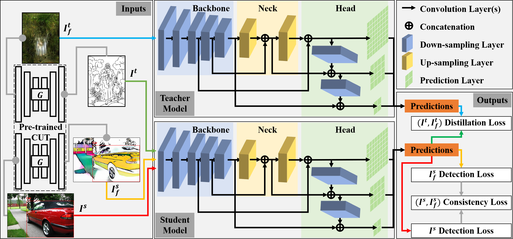
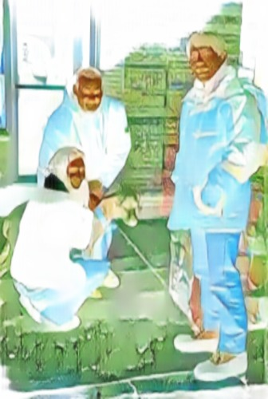
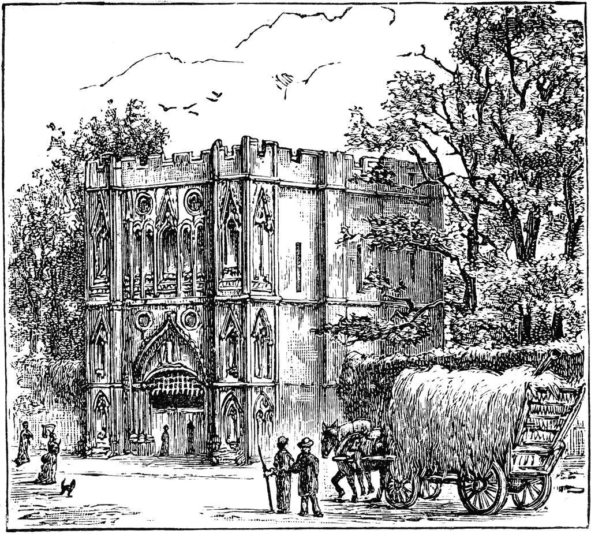
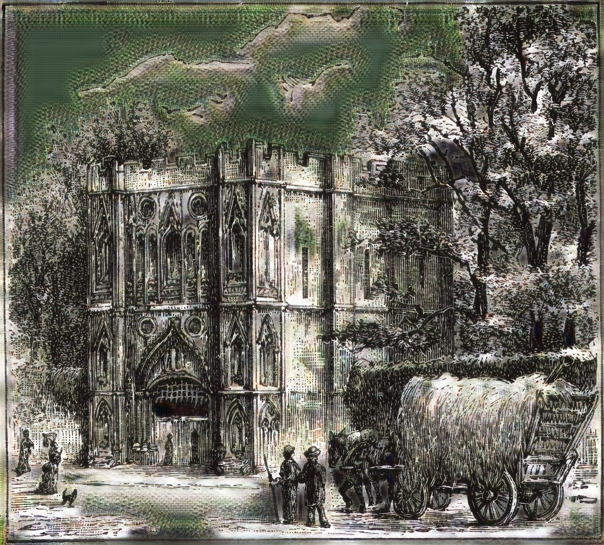
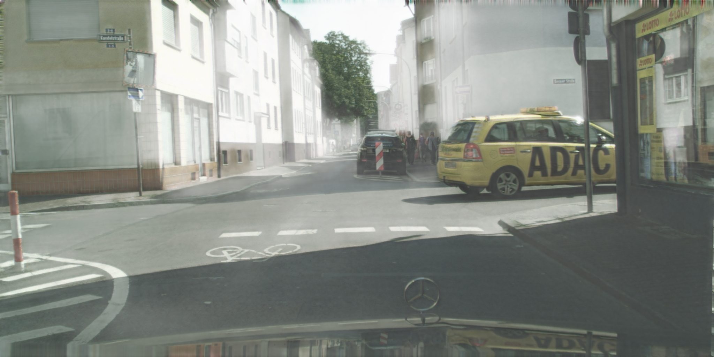
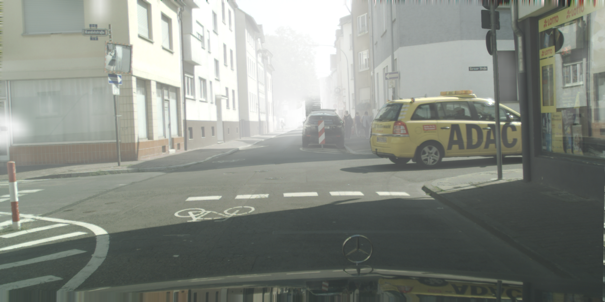
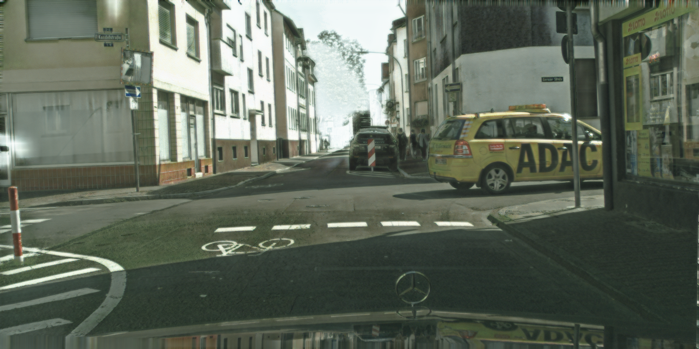

# SSDA-YOLO
Codes for my paper "SSDA-YOLO: Semi-supervised Domain Adaptive YOLO for Cross-Domain Object Detection" submitted to journal *Neurocomputing* (under review)

## Abstarct

*Domain adaptive object detection (DAOD) aims to alleviate transfer performance degradation caused by the cross-domain discrepancy. It is prominent when a distinct divergence arising between the source and target scenarios. However, most existing DAOD methods are dominated by computationally intensive two-stage detectors. In this paper, we propose a novel semi-supervised domain adaptive YOLO (SSDA-YOLO) based method to improve cross-domain detection performance by integrating the compact one-stage detector YOLOv5. Specifically, we adapt the knowledge distillation framework with the Mean Teacher model to assist the student model in obtaining instance-level features of the unlabeled target domain. We also utilize the scene style transfer to cross-generate pseudo images in different domains for remedying image-level differences. In addition, an intuitive consistency loss is proposed to further align cross-domain predictions. We evaluate our proposed SSDA-YOLO on public benchmarks including PascalVOC, Clipart1k, Cityscapes, and Foggy Cityscapes. Moreover, to verify its generalization, we conduct experiments on self-made yawning detection datasets collected from various classrooms. The final results show considerable improvements of our method in these DAOD tasks.*

## Brief Description

SSDA-YOLO is designed for domain adaptative cross-domain object detection based on the knowledge distillation framework and robust `YOLOv5`. The network architecture is as below. 



So far, we have trained and evaluated it on two pubilc available transfer tasks: **PascalVOC → Clipart1k** and **CityScapes → CityScapes Foggy**.

## Installation

**Environment:** Anaconda, Python3.8, PyTorch1.10.0(CUDA11.2), wandb

```bash
$ git clone https://github.com/hnuzhy/SSDA-YOLO.git
$ pip install -r requirements.txt -i https://pypi.tuna.tsinghua.edu.cn/simple

# Codes are only evaluated on GTX3090+CUDA11.2+PyTorch1.10.0. You can follow the same config if needed
# [method 1][directly install from the official website][may slow]
$ pip3 install torch==1.10.0+cu111 torchvision==0.11.1+cu111 torchaudio==0.10.0+cu111 \
  -f https://download.pytorch.org/whl/cu111/torch_stable.html
  
# [method 2]download from the official website and install offline][faster]
$ wget https://download.pytorch.org/whl/cu111/torch-1.10.0%2Bcu111-cp38-cp38-linux_x86_64.whl
$ wget https://download.pytorch.org/whl/cu111/torchvision-0.11.1%2Bcu111-cp38-cp38-linux_x86_64.whl
$ wget https://download.pytorch.org/whl/cu111/torchaudio-0.10.0%2Bcu111-cp38-cp38-linux_x86_64.whl
$ pip3 install torch*.whl
```

## Dataset Preparing

**PascalVOC → Clipart1k**

* **PascalVOC(2007+2012)**: Please follow the instructions in [py-faster-rcnn](https://github.com/rbgirshick/py-faster-rcnn#beyond-the-demo-installation-for-training-and-testing-models) to prepare VOC datasets. Or you can follow the scripts in file [VOC.yaml](./data/yamls_bak/VOC.yaml) to build VOC datasets.
* **Clipart1k**: This datast is originally released in [cross-domain-detection](https://github.com/naoto0804/cross-domain-detection). Dataset preparation instruction is also in it [Cross Domain Detection/datasets](https://github.com/naoto0804/cross-domain-detection/tree/master/datasets).
* **VOC-style → Clipart-style**: Images translated by [CycleGAN](https://github.com/junyanz/pytorch-CycleGAN-and-pix2pix) are available in the website [dt_clipart](https://github.com/naoto0804/cross-domain-detection/tree/master/datasets#download-domain-transferred-images-for-step1-cyclegan) by running `bash prepare_dt.sh`.
* **Clipart-style → VOC-style**: We trained a new image style transfer model based on [CUT(ECCV2020)](https://github.com/taesungp/contrastive-unpaired-translation). The generated 1k VOC-style images are uploaded in [google drive](https://drive.google.com/drive/folders/1Z5Wv6SV-atBNEsi_zBprlg0uVIw3EKGA?usp=sharing).
* **VOC foramt → YOLOv5 format**: Change labels and folders placing from VOC foramt to YOLOv5 format. Follow the script [convert_voc2clipart_yolo_label.py](./data/formats/convert_voc2clipart_yolo_label.py)

**CityScapes → CityScapes Foggy**

* **CityScapes**: Download from the official [website](https://www.cityscapes-dataset.com/downloads/). Images ***leftImg8bit_trainvaltest.zip (11GB) [md5]***; Annotations ***gtFine_trainvaltest.zip (241MB) [md5]***.
* **CityScapes Foggy**: Download from the official [website](https://www.cityscapes-dataset.com/downloads/). Images ***leftImg8bit_trainval_foggyDBF.zip (20GB) [md5]***; Annotations are the same with `CityScapes`. Note, we chose foggy images with `beta=0.02` out of three kind of choices `(0.01, 0.02, 0.005)`.
* **Normal-style → Foggy-style**: We trained a new image style transfer model based on [CUT(ECCV2020)](https://github.com/taesungp/contrastive-unpaired-translation). The generated Foggy-style fake CityScapes images will be uploaded.
* **Foggy-style → Normal-style**: We trained a new image style transfer model based on [CUT(ECCV2020)](https://github.com/taesungp/contrastive-unpaired-translation). The generated Normal-style fake CityScapes Foggy images will be uploaded.
* **VOC foramt → YOLOv5 format**: Follow the script [convert_CitySpaces_yolo_label.py](./data/formats/convert_CitySpaces_yolo_label.py) and [convert_CitySpacesFoggy_yolo_label.py](./data/formats/convert_CitySpacesFoggy_yolo_label.py)


## Examples of Input Image

* **PascalVOC(2007+2012)**

<table>
<tr>
<th>[source real] VOC</th>
<th>[source fake] VOC2Clipart</th>
<th>[target real] Clipart</th>
<th>[target fake] Clipart2VOC</th>
</tr>
<tr>
<td></td>
<td></td> 
<td></td>
<td></td>
</tr>
</table>

* **CityScapes → CityScapes Foggy**

<table>
<tr>
<th>[source real] City Scapes</th>
<th>[source fake] CS2CSF</th>
<th>[target real] CityScapes Foggy</th>
<th>[target fake] CSF2CS</th>
</tr>
<tr>
<td></td>
<td></td> 
<td></td>
<td></td>
</tr>
</table>


## Training and Testing

* **Yamls**

We put the paths of the dataset involved in the training in the yaml file. Five kind of paths are need to be setted. Taking [pascalvoc0712_clipart1k_VOC.yaml](./data/yamls_sda/pascalvoc0712_clipart1k_VOC.yaml) as an example.
```bash
path: root path of datasets;
train_source_real: subpaths of real source images with labels for training. 
  e.g., PascalVOC(2007+2012) trainval set;
train_source_fake: subpaths of fake source images with labels for training. 
  e.g., Clipart-style fake PascalVOC(2007+2012) trainval set;
train_target_real: subpaths of real target images without labels for training. 
  e.g., Clipart1k train set;
train_tatget_fake: subpaths of fake target images without labels for training. 
  e.g., VOC-style fake Clipart1k train set;
test_target_real: subpaths of real target images with labels for testing. 
  e.g., Clipart1k test set;
nc: number of classes;
names: class names list.
```

* **Training**

Still taking **PascalVOC → Clipart1k** as an example. The pretrained model `yolov5l.pt` can be downloaded from the official YOLOv5 website.
```bash
python -m torch.distributed.launch --nproc_per_node 4 \
  ssda_yolov5_train.py \
  --weights weights/yolov5l.pt \
  --data yamls_sda/pascalvoc0712_clipart1k_VOC.yaml \
  --name voc2clipart_ssda_960_yolov5l \
  --img 960 --device 0,1,2,3 --batch-size 24 --epochs 200 \
  --lambda_weight 0.005 --consistency_loss --alpha_weight 2.0
```

If you want to resume a breakout training, following the script below.
```bash
python -m torch.distributed.launch --nproc_per_node 4 -master_port 12345 \
  ssda_yolov5_train.py \
  --weights weights/yolov5l.pt \
  --data yamls_ssda/pascalvoc0712_clipart1k_VOC.yaml \
  --name voc2clipart_ssda_960_yolov5l_R \
  --student_weight runs/train/voc2clipart_ssda_960_yolov5l/weights/best_student.pt \
  --teacher_weight runs/train/voc2clipart_ssda_960_yolov5l/weights/best_teacher.pt \
  --img 960 --device 0,1,2,3 --batch-size 24 --epochs 200 \
  --lambda_weight 0.005 --consistency_loss --alpha_weight 2.0
```

* **Testing**

After finishing the training of **PascalVOC → Clipart1k** task.
```bash
python ssda_yolov5_test.py --data yamls_sda/pascalvoc0712_clipart1k_VOC.yaml \
    --weights runs/train/voc2clipart_ssda_960_yolov5l/weights/best_student.pt \
    --name voc2clipart_ssda_960_yolov5l \
    --img 960 --batch-size 4 --device 0
```


## References

* [YOLOv5 🚀 in PyTorch > ONNX > CoreML > TFLite](https://github.com/ultralytics/yolov5)
* [UMT(A Pytorch Implementation of Unbiased Mean Teacher for Cross-domain Object Detection (CVPR 2021))](https://github.com/kinredon/umt)
* [CUT - Contrastive unpaired image-to-image translation, faster and lighter training than cyclegan (ECCV 2020, in PyTorch)](https://github.com/taesungp/contrastive-unpaired-translation)

